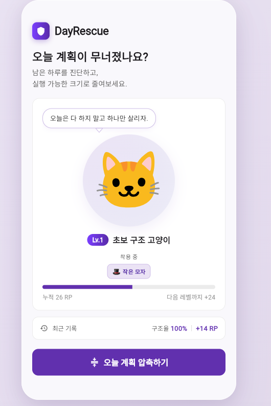
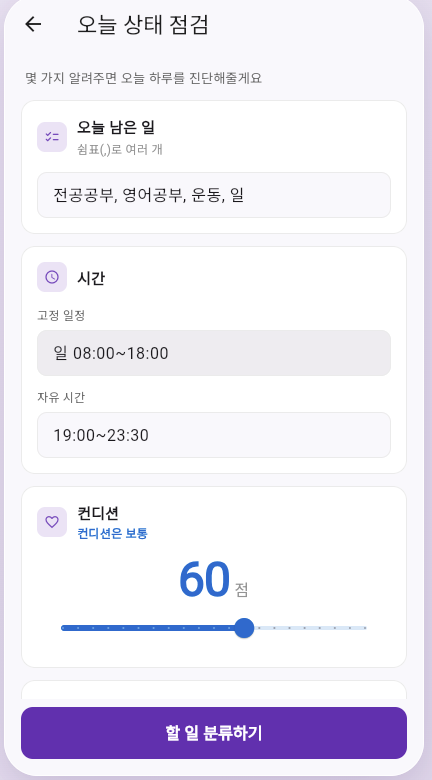
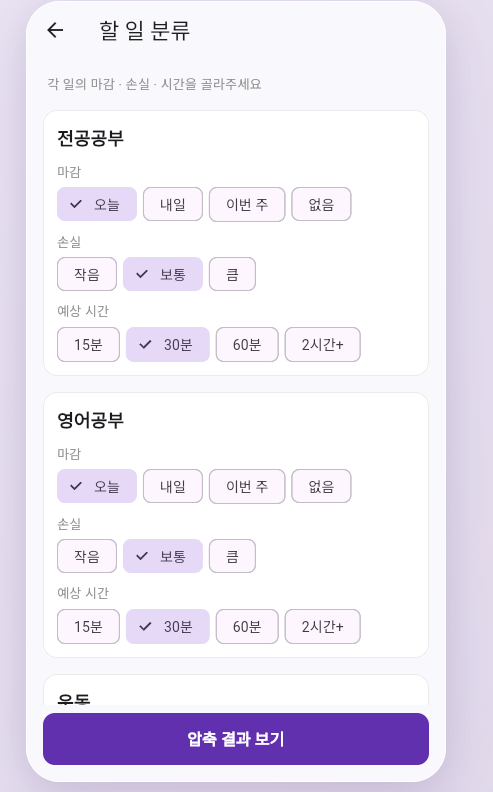
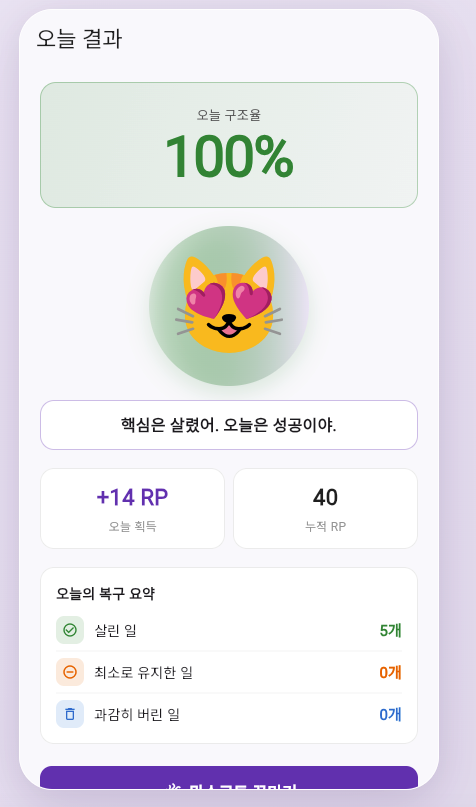
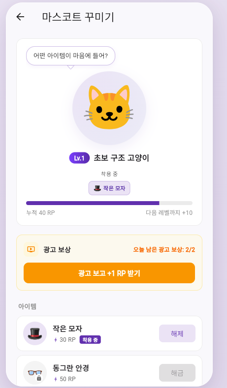

# DayRescue

A Flutter MVP productivity app that helps users recover a disrupted day by compressing unfinished tasks into executable rescue plans.

> Decisions stay with the user. DayRescue helps reduce a broken plan into something executable.
> 결정은 사용자가 하고, AI는 무너진 계획을 실행 가능한 크기로 줄인다.

## Tech Highlights

- Flutter
- Dart
- SharedPreferences
- Rule-based plan compression
- Rescue Point system
- Mascot interaction
- GitHub portfolio project

## Table of Contents

1. [Project Overview](#1-project-overview)
2. [Problem](#2-problem)
3. [Solution](#3-solution)
4. [Key Features](#4-key-features)
5. [Screenshots](#5-screenshots)
6. [Tech Stack](#6-tech-stack)
7. [App Flow](#7-app-flow)
8. [Project Structure](#8-project-structure)
9. [What I Learned](#9-what-i-learned)
10. [Future Improvements](#10-future-improvements)
11. [How to Run](#11-how-to-run)
12. [Development Notes](#12-development-notes)

---

## 1. Project Overview

**DayRescue** is a Flutter MVP that turns a broken daily plan into an executable rescue plan.

The product principle is deliberate:

> **The user owns priorities. The app owns execution-sizing.**

Most planning apps assume the user will execute the plan as written. DayRescue starts from the opposite assumption: **the plan has already fallen apart, and the user needs help recovering — not more guilt.** The user provides five quick inputs, and the app responds with a diagnosis and two ranked plans to choose between.

- 🎯 **Decision boundary** — the user picks priorities; the app shrinks the workload.
- 🐱 **Companion** — a leveling mascot reacts to effort and grows with accumulated points.
- 🧩 **Swap-ready engine** — ships without an LLM, but the compression logic is isolated behind a single service so an AI API can replace it later without changing screens.

---

## 2. Problem

Most users have a daily plan. Most users see it collapse by mid-day. From quick interviews with friends and classmates, three patterns kept showing up:

| Behavior | Result |
| --- | --- |
| Ignore the calendar notification | The plan becomes invisible |
| Try to "catch up" on everything | Burns out, finishes nothing |
| Declare the day a total loss | Skips even the 15-minute item that actually mattered |

Existing tools — to-do apps, calendars, habit trackers — assume the plan will be executed as written. **None of them help after the plan is already broken.**

---

## 3. Solution

DayRescue treats a broken day as a **state to diagnose and recover**, not a failure to feel guilty about.

The recovery flow is:

1. **Ask** for five inputs — remaining tasks, fixed schedule, free time, condition, must-save task.
2. **Diagnose** plan overload, condition rating, and a recovery strategy.
3. **Compress** the day into **two ranked plans**:
   - **Focus Recovery** — keep the core task plus light routines.
   - **Minimum Survival** — keep only what you must, drop the rest without guilt.
4. **Check** completion item by item with five status options.
5. **Reward** with Rescue Points (RP). The mascot reacts to the rescue rate, levels up, and accumulates RP across sessions.

The compression is **rule-based** in this MVP, but is built behind a single class (`PlanCompressor.compress(...)`) so it can be swapped to an LLM call later with zero changes to the UI layer.

---

## 4. Key Features

#### Input
- Comma-separated remaining tasks
- Fixed schedule, free-time window
- Condition score 0–100 (with color-coded label that updates as you drag)
- The one task to save today

#### Task Classification
- One card per task with deadline / loss / estimated duration options.

#### Today's Diagnosis Card
- Plan overload (high / medium / low) by task count
- Condition rating
- Suggested recovery strategy
- One-line approach for the day

#### Two-Plan Compression
- **Focus Recovery**: keeps mandatory + core + light routines, durations capped sensibly.
- **Minimum Survival**: keeps only must-save items; everything else minimum or excluded.
- Every task card explains its assignment in one line ("이유: 마감이 오늘이고 손실이 큼").

#### Completion Check
- Five completion states: Complete / Reduced / Minimum / Failed / Dropped.
- RP per choice is rendered directly on each chip — no guessing.

#### Result & RP
- 56pt rescue-rate percentage with mascot reaction.
- Today's rescue summary: saved / minimum / dropped / failed counts.
- "Recent record" pill on home: last rescue rate + last earned RP.

#### Mascot
- 5-level system (Lv.1 → Lv.5) based on cumulative RP.
- Tap to bounce, randomize expression, and rotate motivational quotes.
- Speech bubble with a custom-painted tail.
- 5 unlockable accessories purchased with RP; equipped items render on the home mascot.

#### Ad Reward UI
- "Watch ad +1 RP" button (UI only, **no SDK connected**).
- Capped at 2 uses per day with automatic date reset.

---

## 5. Screenshots

<table>
  <tr>
    <td width="50%" align="center">
      
      <br />
      <strong>Home</strong>
      <br />
      <sub>Mascot hero with level, accumulated RP, and recent rescue record. Tap the mascot for a motivational quote.</sub>
    </td>
    <td width="50%" align="center">
      
      <br />
      <strong>Input</strong>
      <br />
      <sub>Five quick inputs to compress today: remaining tasks, fixed schedule, free time, condition, and must-save task.</sub>
    </td>
  </tr>
  <tr>
    <td width="50%" align="center">
      
      <br />
      <strong>Task Classification</strong>
      <br />
      <sub>Each task gets options for deadline, loss, and estimated duration. The compressor uses these to score priorities.</sub>
    </td>
    <td width="50%" align="center">
      
      <br />
      <strong>Result</strong>
      <br />
      <sub>Big rescue-rate percentage, mascot reaction by tier, and today's recovery summary (saved / minimum / dropped).</sub>
    </td>
  </tr>
  <tr>
    <td colspan="2" align="center">
      
      <br />
      <strong>Mascot Shop</strong>
      <br />
      <sub>Level and RP progress bar, equipped-item badges, daily ad-reward UI, and unlockable accessories.</sub>
    </td>
  </tr>
</table>

---

## 6. Tech Stack

| Layer | Tool |
| --- | --- |
| Framework | **Flutter** (Material 3) |
| Language | **Dart** 3.x |
| State management | `setState` (intentionally minimal for the MVP) |
| Persistence | **SharedPreferences** (single source of truth in `storage_service.dart`) |
| Animation | `AnimationController`, `AnimatedSwitcher`, `TweenSequence`, `CurvedAnimation` |
| Custom drawing | `CustomPainter` (speech-bubble tail) |
| Lifecycle | `WidgetsBindingObserver` (reload on tab resume) |
| Source control | **Git / GitHub** |
| Web debugging | `flutter run -d chrome --web-port 5001` |

---

## 7. App Flow

```
Home  →  Input  →  Task Classification  →  Plan Compression
                                                    │
                                                    ▼
Mascot Shop  ←  Result  ←  Completion Check  ←  (choose Focus / Survival)
```

- Navigation uses standard `Navigator.push` / `pushReplacement`.
- `pushReplacement` from completion → result so the user can't "back" into a half-finished state.
- Home reloads from `SharedPreferences` whenever the back-stack returns and whenever the app resumes from background (`WidgetsBindingObserver`).

---

## 8. Project Structure

```
lib/
├── main.dart                        # entry; warms up SharedPreferences before runApp
├── models/
│   ├── task_item.dart               # one row of user input
│   ├── compressed_task.dart         # one row of compression output (with one-line reason)
│   ├── rescue_plan.dart             # plan bundle (mode + tasks + success + time blocks)
│   ├── diagnosis.dart               # overload + condition + strategy
│   ├── mascot_item.dart             # shop items
│   └── mascot_level.dart            # RP → level / title / progress
├── services/
│   ├── plan_compressor.dart         # rule-based engine — single LLM swap point
│   ├── diagnosis_service.dart       # rule-based diagnosis
│   ├── rp_service.dart              # RP per (process type × completion status)
│   └── storage_service.dart         # single source of truth for SharedPreferences
├── widgets/
│   ├── app_shell.dart               # desktop phone-frame wrapper (Chrome ≥ 700px)
│   ├── screen_shell.dart            # mobile-width clamp inside the frame
│   ├── mascot_widget.dart           # animated mascot (bounce + face rotation)
│   ├── mascot_box.dart              # mascot + level + RP bar + speech bubble
│   ├── diagnosis_card.dart          # today's diagnosis card
│   ├── plan_task_card.dart          # compressed-task card with reason
│   ├── task_card.dart               # classification screen card
│   └── primary_button.dart          # primary + secondary button styles
└── screens/
    ├── home_screen.dart
    ├── input_screen.dart
    ├── task_classification_screen.dart
    ├── compressed_plan_screen.dart
    ├── completion_check_screen.dart
    ├── result_screen.dart
    └── mascot_shop_screen.dart
```

`services/` is intentionally isolated so the rule-engine MVP can be replaced by an LLM call without touching the UI.

---

## 9. What I Learned

- **Designing the swap point matters.** Putting `PlanCompressor.compress()` behind a single class with a fixed return shape meant I could iterate on rules freely while the rest of the app didn't need to know.
- **A single source of truth for storage is worth the boilerplate.** Centralizing every `SharedPreferences` key in `storage_service.dart` killed an entire class of bugs (mismatched keys across screens).
- **Animation budget is small but visible.** A 400 ms gummy bounce plus a 250 ms emoji crossfade was enough to make the mascot feel alive without slowing the flow.
- **Flutter web has a quiet footgun.** `SharedPreferences` on web is backed by `localStorage`, which is scoped per origin (host **plus port**). Always running with `--web-port 5001` saved hours of debugging "lost" RP.
- **The tone of a "broken day" UX matters.** Encouragement language matters more than checkmarks. Wording is part of the product.

---

## 10. Future Improvements

- 🤖 **LLM integration** — swap `PlanCompressor` for an OpenAI / Claude call without touching screens.
- 🎨 **Mascot illustrations** — replace emoji with hand-drawn frames and full expression sets per state.
- ✨ **Richer animations** — level-up burst, completion confetti, bubble shake.
- 📱 **App Store / Play Store release** — polish iOS / Android builds and ship.
- 🔥 **Firebase integration** — anonymous accounts, cross-device sync, push notifications.
- 🎬 **Real reward-ad SDK** — AdMob or similar, behind a feature flag.
- 📊 **Weekly report** — rescue-rate trends, recurring excluded items, mascot growth.
- 🌐 **English locale** — `flutter_localizations` for global testing.

---

## 11. How to Run

Requirements: Flutter 3.x with web enabled.

```bash
cd dayrescue
flutter pub get
flutter run -d chrome
```

Recommended for stable persistence during development:

```bash
flutter run -d chrome --web-port 5001
```

> Flutter web stores `SharedPreferences` in the browser's `localStorage`, which is scoped to origin (host + port). Using a fixed port keeps your cumulative RP across restarts.

---

## 12. Development Notes

- **Rule-based, not AI.** The MVP runs entirely on local rules; no external AI API is connected. Compression logic is isolated in `lib/services/plan_compressor.dart` so an LLM can replace it later without rewriting screens.
- **Persistence.** `SharedPreferences` powers all storage: cumulative RP, recent rescue rate, recent earned RP, unlocked items, equipped items, and the daily ad-reward counter. All keys live in `StorageService` as a single source of truth.
- **Ads.** The "Watch ad +1 RP" button is UI-only with a per-day cap. No real ad SDK is wired in.
- **In-app purchase.** Not implemented in this MVP.
- **Login / accounts.** Not implemented; the app is fully local.
- **Primary tested platform.** Chrome web. Android / iOS builds should work via the existing platform folders but haven't been polished.

---

<p align="center">
  <strong>DayRescue · Flutter MVP · 2026</strong><br>
  <em>Make the broken day smaller.</em>
</p>
