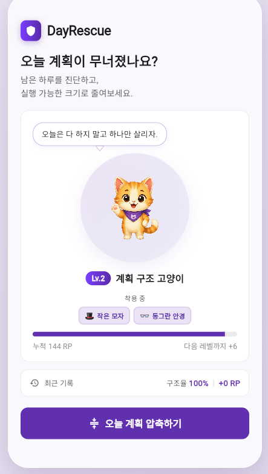
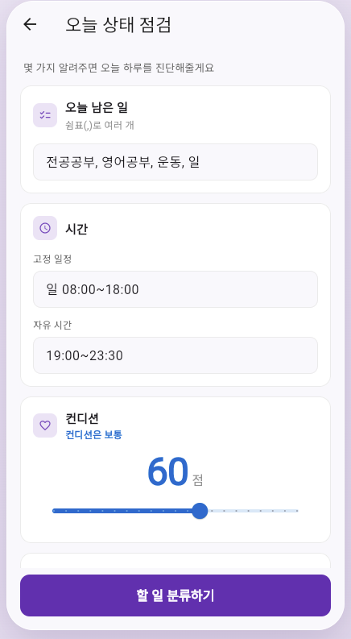
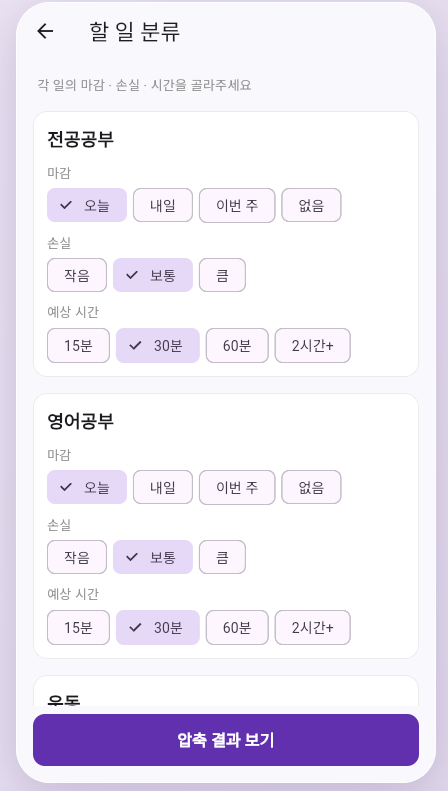
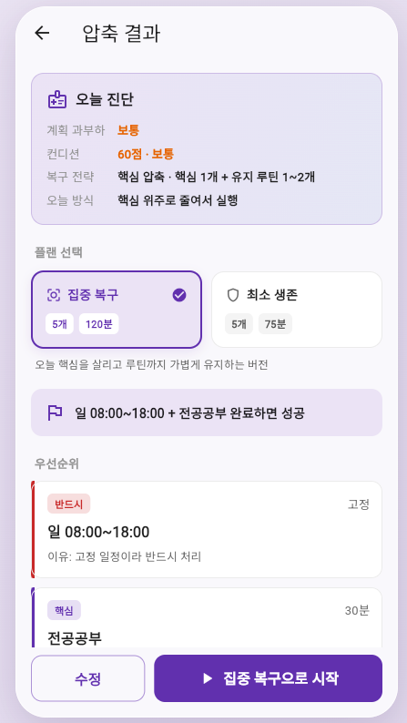
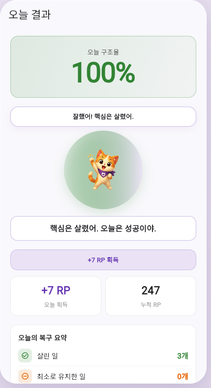
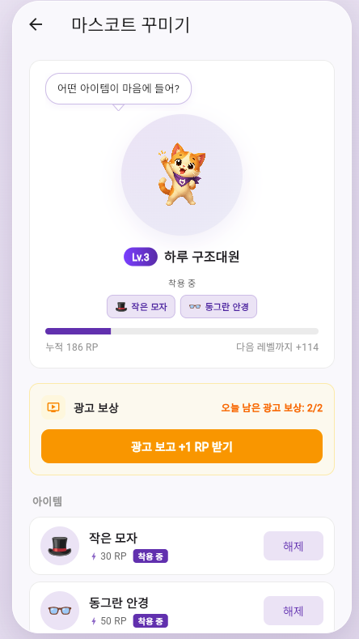

# DayRescue

A Flutter MVP productivity app that helps users recover a disrupted day by compressing unfinished tasks into executable rescue plans.

> Decisions stay with the user. DayRescue helps reduce a broken plan into something executable.
> 결정은 사용자가 하고, AI는 무너진 계획을 실행 가능한 크기로 줄인다.


## Project Roadmap

See the project roadmap here:

[ROADMAP.md](./ROADMAP.md)

## Live Demo

Try DayRescue here:

https://josh1261.github.io/dayrescue-flutter/

## Tech Highlights

- Flutter
- Dart
- SharedPreferences
- Rule-based structure-plan engine (5-action classifier)
- Rescue Point system
- Mascot interaction
- Automated web deployment (GitHub Actions → GitHub Pages)

## Table of Contents

1. [Project Overview](#1-project-overview)
2. [Problem](#2-problem)
3. [Solution](#3-solution)
4. [Key Features](#4-key-features)
5. [Screenshots](#5-screenshots)
6. [Tech Stack](#6-tech-stack)
7. [App Flow](#7-app-flow)
8. [Project Structure](#8-project-structure)
9. [Testing](#9-testing)
10. [What I Learned](#10-what-i-learned)
11. [Future Improvements](#11-future-improvements)
12. [How to Run](#12-how-to-run)
13. [Development Notes](#13-development-notes)

---

## 1. Project Overview

**DayRescue** is a Flutter MVP that turns a broken daily plan into an executable rescue plan.

The product principle is deliberate:

> **The user owns priorities. The app owns execution-sizing.**

Most planning apps assume the user will execute the plan as written. DayRescue starts from the opposite assumption: **the plan has already fallen apart, and the user needs help recovering — not more guilt.** The user gives a few quick inputs — only the remaining-tasks field is required, the rest auto-fill with sensible defaults — and the app responds with a diagnosis and a single executable structure plan for today.

- 🎯 **Decision boundary** — the user picks priorities; the app shrinks the workload.
- 🐱 **Companion** — a leveling mascot reacts to effort and grows with accumulated points.
- 🧩 **Swap-ready engine** — ships without an LLM, but the compression logic is isolated behind a single service so an AI API can replace it later without changing screens.

---

## 2. Problem

Most users have a daily plan. Most users see it collapse by mid-day. From quick interviews with friends and classmates, three patterns kept showing up:

| Behavior | Result |
| --- | --- |
| Ignore the calendar notification | The plan becomes invisible |
| Try to "catch up" on everything | Burns out, finishes nothing |
| Declare the day a total loss | Skips even the 15-minute item that actually mattered |

Existing tools — to-do apps, calendars, habit trackers — assume the plan will be executed as written. **None of them help after the plan is already broken.**

---

## 3. Solution

DayRescue treats a broken day as a **state to diagnose and recover**, not a failure to feel guilty about.

The recovery flow is:

1. **Ask** for a few inputs — remaining tasks, fixed schedule, free time, condition, must-save task. Only remaining tasks is required; example chips and default fallbacks fill the rest.
2. **Diagnose** plan overload, condition rating, and a recovery strategy.
3. **Compress** the day into a **single structure plan**. `PlanCompressor` scores each task and assigns it one of five actions — **반드시 / 핵심 / 유지 / 최소 / 제외** (mandatory / core / keep / minimum / exclude) — each with a reason and a next-action hint, plus a success criterion and an ordered execution timeline. Excluded items are framed as a strategic "set aside for today," not a failure.
4. **Check** completion item by item with five status options.
5. **Reward** with Rescue Points (RP). The mascot reacts to the rescue rate, levels up, and accumulates RP across sessions.

The compression is **rule-based** in this MVP, but is built behind a single class (`PlanCompressor.compress(...)`) so it can be swapped to an LLM call later with zero changes to the UI layer.

---

## 4. Key Features

#### Input UX v2
- Four quick-check cards: remaining tasks, time (fixed schedule / free time), condition, and the one task to save today.
- One-tap example chips fill realistic inputs (`공부, 운동, 영어`, `19:00~23:00`) so a tired user never faces a blank form.
- Only remaining tasks is required — empty optional fields fall back to sensible defaults (free time → `19:00~23:00`, must-save → first remaining task).
- Condition score 0–100 with a live color-coded label and quick presets (25 / 50 / 70).

#### Task Classification
- One card per task with deadline / loss / estimated duration options.

#### Today's Diagnosis Card
- Plan overload (high / medium / low) by task count.
- Condition rating and a suggested recovery strategy.
- A one-line "approach for today" from the overload × condition matrix.

#### Structure Plan — decision logic
- `PlanCompressor` scores every task (must-save, deadline, loss, condition) and assigns each one of five actions: **반드시 / 핵심 / 유지 / 최소 / 제외** (mandatory / core / keep / minimum / exclude).
- Long tasks are capped to an executable duration; recovery items (휴식 · 산책 …) are kept on low-condition days rather than dropped.
- The result is one plan — a success criterion plus an ordered execution timeline — not a menu of plans to compare.

#### Reason & next-action hint on every card
- Each task card explains *why* it landed in its category in one friendly line.
- A highlighted band gives the immediate next action (e.g. "타이머 30분 맞추고 바로 시작해요").
- Excluded tasks appear under "잠시 내려놓기" as a strategic set-aside for today — never as a failure.

#### Completion Check
- Five completion states: Complete / Reduced / Minimum / Failed / Dropped.
- RP per choice is rendered directly on each chip — no guessing.

#### Result & RP
- Large rescue-rate percentage with a matching mascot reaction.
- Today's rescue summary: saved / minimum / dropped / failed counts.
- "Recent record" pill on home: last rescue rate + last earned RP.

#### Mascot
- 5-level system (Lv.1 → Lv.5) based on cumulative RP.
- Reacts to the rescue rate (cheer / success / comfort) — supportive on low results, never blaming.
- Tap to bounce, randomize expression, and rotate motivational quotes; speech bubble with a custom-painted tail.
- 5 unlockable accessories purchased with RP; equipped items render on the home mascot.

#### Reward UI
- "Watch ad +1 RP" button (UI only, **no SDK connected**), capped at 2 uses per day with an automatic date reset.
- Task-based RP can only be claimed once per day to prevent farming the completion flow.

#### Engineering & delivery
- Rule engine isolated behind a single `PlanCompressor.compress(...)` call — the one swap point for a future LLM.
- Manual test cases in [`TEST_CASES.md`](./TEST_CASES.md) and unit tests for the compression logic in [`test/plan_compressor_test.dart`](./test/plan_compressor_test.dart).
- Automated web build + deploy to GitHub Pages via GitHub Actions on every push to `main`.

---

## 5. Screenshots

<table>
  <tr>
    <td width="50%" align="center">
      
      <br />
      <strong>Home</strong>
      <br />
      <sub>Main screen with mascot and recent rescue stats.</sub>
    </td>
    <td width="50%" align="center">
      
      <br />
      <strong>Input</strong>
      <br />
      <sub>Daily status check with tasks, schedule, free time, and condition.</sub>
    </td>
  </tr>
  <tr>
    <td width="50%" align="center">
      
      <br />
      <strong>Classification</strong>
      <br />
      <sub>Task urgency, loss, and time classification.</sub>
    </td>
    <td width="50%" align="center">
      
      <br />
      <strong>Plan Result</strong>
      <br />
      <sub>Diagnosis card and today's structure plan.</sub>
    </td>
  </tr>
  <tr>
    <td width="50%" align="center">
      
      <br />
      <strong>Result</strong>
      <br />
      <sub>Rescue rate, earned RP, and recovery summary.</sub>
    </td>
    <td width="50%" align="center">
      
      <br />
      <strong>Mascot Shop</strong>
      <br />
      <sub>RP-based mascot customization shop.</sub>
    </td>
  </tr>
</table>

---

## 6. Tech Stack

| Layer | Tool |
| --- | --- |
| Framework | **Flutter** (Material 3) |
| Language | **Dart** 3.x |
| State management | `setState` (intentionally minimal for the MVP) |
| Persistence | **SharedPreferences** (single source of truth in `storage_service.dart`) |
| Animation | `AnimationController`, `AnimatedSwitcher`, `TweenSequence`, `CurvedAnimation` |
| Custom drawing | `CustomPainter` (speech-bubble tail) |
| Lifecycle | `WidgetsBindingObserver` (reload on tab resume) |
| Source control | **Git / GitHub** |
| Web debugging | `flutter run -d chrome --web-port 5001` |

---

## 7. App Flow

```
Home  →  Input  →  Task Classification  →  Structure Plan
                                                  │
                                                  ▼
Mascot Shop  ←  Result  ←  Completion Check  ←────┘
```

- Navigation uses standard `Navigator.push` / `pushReplacement`.
- The structure-plan screen offers "수정하기" (back to edit inputs) or "이대로 시작" to continue into the completion check.
- `pushReplacement` from completion → result so the user can't "back" into a half-finished state.
- Home reloads from `SharedPreferences` whenever the back-stack returns and whenever the app resumes from background (`WidgetsBindingObserver`).

---

## 8. Project Structure

```
lib/
├── main.dart                        # entry; warms up SharedPreferences before runApp
├── models/
│   ├── task_item.dart               # one row of user input
│   ├── compressed_task.dart         # one compression result (process type + reason + next-action hint)
│   ├── diagnosis.dart               # overload + condition + strategy
│   ├── mascot_item.dart             # shop items
│   └── mascot_level.dart            # RP → level / title / progress
├── services/
│   ├── plan_compressor.dart         # rule-based engine: scores + 5-action classifier — single LLM swap point
│   ├── diagnosis_service.dart       # rule-based diagnosis
│   ├── rp_service.dart              # RP per (process type × completion status)
│   └── storage_service.dart         # single source of truth for SharedPreferences
├── widgets/
│   ├── app_shell.dart               # desktop phone-frame wrapper (Chrome ≥ 700px)
│   ├── screen_shell.dart            # mobile-width clamp inside the frame
│   ├── bottom_action_bar.dart       # fixed bottom primary-action bar
│   ├── home_action.dart             # app-bar shortcut back to home
│   ├── mascot_widget.dart           # animated mascot (bounce + face rotation)
│   ├── mascot_box.dart              # mascot + level + RP bar + speech bubble
│   ├── diagnosis_card.dart          # today's diagnosis card
│   ├── plan_task_card.dart          # structure-plan card: badge + reason + next-action hint
│   ├── task_card.dart               # classification screen card
│   └── primary_button.dart          # primary + secondary button styles
└── screens/
    ├── home_screen.dart
    ├── input_screen.dart
    ├── task_classification_screen.dart
    ├── compressed_plan_screen.dart
    ├── completion_check_screen.dart
    ├── result_screen.dart
    └── mascot_shop_screen.dart
```

`services/` is intentionally isolated so the rule-engine MVP can be replaced by an LLM call without touching the UI.

---

## 9. Testing

DayRescue uses both manual and automated testing.

### Manual Test Cases

Manual test cases are documented in [`TEST_CASES.md`](./TEST_CASES.md).

They cover realistic recovery situations such as:

- Normal study routine
- Low-condition day
- Urgent assignment day
- Too many remaining tasks
- Empty optional fields

### Unit Tests

Core plan-compression behavior is tested in [`test/plan_compressor_test.dart`](./test/plan_compressor_test.dart).

The unit tests verify:

- Must-save tasks become core tasks
- Low-condition days reduce optional tasks
- Urgent large-loss tasks stay prioritized
- Fixed schedules are added as mandatory tasks
- Time blocks are generated from available time
- Recovery tasks are preserved when condition is low
- Empty free-time input falls back to a default start time
- Long tasks are capped to an executable duration
- Excluded optional tasks use non-blaming reason text

This keeps the rescue-plan logic safer to improve over time.

> Note: GitHub Actions handles **deployment**, not test execution — run `flutter test` locally before pushing changes.

---

## 10. What I Learned

- **Designing the swap point matters.** Putting `PlanCompressor.compress()` behind a single class with a fixed return shape meant I could iterate on rules freely while the rest of the app didn't need to know.
- **A single source of truth for storage is worth the boilerplate.** Centralizing every `SharedPreferences` key in `storage_service.dart` killed an entire class of bugs (mismatched keys across screens).
- **Animation budget is small but visible.** A 400 ms gummy bounce plus a 250 ms emoji crossfade was enough to make the mascot feel alive without slowing the flow.
- **Flutter web has a quiet footgun.** `SharedPreferences` on web is backed by `localStorage`, which is scoped per origin (host **plus port**). Always running with `--web-port 5001` saved hours of debugging "lost" RP.
- **The tone of a "broken day" UX matters.** Encouragement language matters more than checkmarks. Wording is part of the product.
- **Tests turned rule-tweaking into a checklist.** Unit tests in `plan_compressor_test.dart` pin down the key compression branches (must-save, deadline, loss, condition), so I can change scoring and instantly see what I broke — while `TEST_CASES.md` keeps the whole-flow, qualitative checks that unit tests can't. Writing both made the rescue logic safe to keep improving.
- **Manual testing and watching real users paid off.** Replaying the completion flow exposed an RP-farming exploit (fixed with a once-per-day claim guard), and seeing tired users stall on a blank form drove Input UX v2's example chips and auto-filled defaults. Validation surfaced product bugs and friction that reading the code alone wouldn't.

---

## 11. Future Improvements

- 🤖 **LLM integration** — swap `PlanCompressor` for an OpenAI / Claude call without touching screens.
- 🎨 **Mascot illustrations** — replace emoji with hand-drawn frames and full expression sets per state.
- ✨ **Richer animations** — level-up burst, completion confetti, bubble shake.
- 📱 **App Store / Play Store release** — polish iOS / Android builds and ship.
- 🔥 **Firebase integration** — anonymous accounts, cross-device sync, push notifications.
- 🎬 **Real reward-ad SDK** — AdMob or similar, behind a feature flag.
- 📊 **Weekly report** — rescue-rate trends, recurring excluded items, mascot growth.
- 🌐 **English locale** — `flutter_localizations` for global testing.

---

## 12. How to Run

Requirements: Flutter 3.x with web enabled.

```bash
cd dayrescue
flutter pub get
flutter run -d chrome
```

Recommended for stable persistence during development:

```bash
flutter run -d chrome --web-port 5001
```

> Flutter web stores `SharedPreferences` in the browser's `localStorage`, which is scoped to origin (host + port). Using a fixed port keeps your cumulative RP across restarts.

---

## 13. Development Notes

- **Rule-based, not AI.** The MVP runs entirely on local rules; no external AI API is connected. Compression logic is isolated in `lib/services/plan_compressor.dart` so an LLM can replace it later without rewriting screens.
- **Persistence.** `SharedPreferences` powers all storage: cumulative RP, recent rescue rate, recent earned RP, unlocked items, equipped items, and the daily ad-reward counter. All keys live in `StorageService` as a single source of truth.
- **Ads.** The "Watch ad +1 RP" button is UI-only with a per-day cap. No real ad SDK is wired in.
- **In-app purchase.** Not implemented in this MVP.
- **Login / accounts.** Not implemented; the app is fully local.
- **Primary tested platform.** Chrome web. Android / iOS builds should work via the existing platform folders but haven't been polished.

---

<p align="center">
  <strong>DayRescue · Flutter MVP · 2026</strong><br>
  <em>Make the broken day smaller.</em>
</p>
